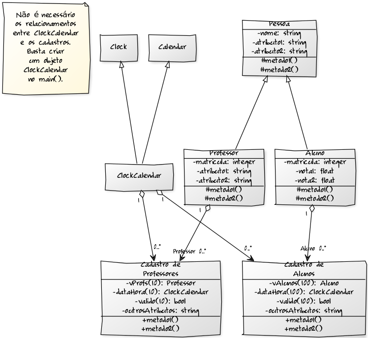

# Exercício Aula 04 - Herança

Desenvolver um programa para cálculo e armazenagem das notas dos alunos em uma disciplina. Considerar que a disciplina possui apenas duas avaliações, e o programa permite a entrada das notas das duas avaliações para cada um dos 20 alunos da turma, e calcula a nota final. As informações sobre as notas e número de matrícula dos alunos devem ficar armazenadas em um vetor que representa o cadastro de alunos. Esse vetor deverá armazenar objetos Aluno, sendo que cada objeto aluno deverá possuir os atributos e métodos necessários para a resolução do problema. O programa deverá possuir facilidades para o usuário realizar operações de entrada de dados (o número de matrícula deve ser único), consulta a um aluno, listagem de todos os alunos mostrando todos os campos, exclusão de alunos, e alteração dos dados de um aluno (o número de matrícula não pode ser alterado).

Alterar a implementação realizada (pelo próprio aluno, ou a sugestão de implementação fornecida acima), visando incluir as seguintes funcionalidades:

* Aumentar o limite máximo para n alunos, onde n é uma constante definida estáticamente no corpo do programa, antes da geração do executável.
* Utilizar as classes Clock, Calendar, e ClockCalendar desenvolvidas na aula sobre herança múltipla.
* Definir uma classe Pessoa, que servirá como uma classe base para Aluno ("Aluno" deverá herdar "Pessoa").
* A classe Aluno (classe derivada de Pessoa) deverá herdar atributos e métodos da classe Pessoa (classe base), tais como nome e data de nascimento. A classe Aluno deverá possuir apenas atributos relacionados a um aluno como, por exemplo, número de matrícula e notas.
* Definir uma classe Professor que, assim como a classe Aluno, também será derivada de Pessoa ("Aluno" e "Professor" são ambos "Pessoas").
* Implementar um cadastro de professores, utilizando um vetor, de forma semelhante ao cadastro de alunos.
* O cadastro de alunos (vetor) deverá possuir mais dois campos (em cada posição do vetor):
* Um campo para armazenar a informação de data e hora da inclusão (ou alteração) do aluno no cadastro. Essa informação deve ser obtida por intermédio da classe ClockCalendar.
* Um campo para armazenar o número de matrícula do professor que realizou o cadastro do aluno.
* O cadastro de professores (vetor) também deverá possuir um campo para armazenar a informação de data e hora da inclusão (ou alteração) do professor no cadastro.
* O novo menu do programa deverá possuir, no mínimo, as seguintes opções:

    1. Login
    2. Logout
    3. Incluir aluno
    4. Excluir aluno
    5. Alterar aluno
    6. Consultar aluno
    7. Listar alunos
    8. Incluir professor
    9. Excluir professor
    10. Alterar professor
    11. Consultar professor
    12. Listar professores

* Notar que nesse novo menu não existe uma opção para "sair" do programa, uma vez que o objetivo final é a utilização em um sistema embarcado, onde o programa deverá permanecer em laço infinito. Assumir que o hardware alvo foi concebido especialmente para execução desse programa, e não faz sentido "encerrar" o programa, uma vez que o sistema embarcado em questão não possui outras funcionalidades.
* Trata-se de um programa para uso exclusivo de professores, onde todos os professores possuem permissão para realizar todas as operações listadas no menu.
* As opções 2 a 12 do menu só serão aceitas, caso algum professor tenha realizado um login. Caso um professor tente realizar alguma operação sem ter realizado o login, o sistema não deverá permitir.
* Sempre que um login for realizado, a opção 1 (login) deverá permanecer bloqueada até que a opção 2 (logout) tenha sido selecionada. Dessa forma, não é permitido que mais de um professor utilize o programa simultaneamente.
* Quando um professor realiza o login, o programa deverá fazer uma pesquisa no cadastro de professores, para ver se o professor em questão está cadastrado. Só será permitido o login de professores cadastrados previamente.

> Obs. No caso de não existir nenhum professor cadastrado, então será permitido o login, mas apenas a opção "Incluir professor" deverá estar disponível.

* Existe um limite máximo de m professores que poderão utilizar o sistema. Esse é o número máximo de professores que podem dar aulas, e lançar notas, para os n alunos da turma. Da mesma forma que n, m também é uma constante definida estáticamente no corpo do programa, antes da geração do executável.
* Ao concluir a utilização do sistema, o professor deverá realizar o logout (opcão 2 do menu), e o programa deverá permanecer aguardando por um novo login (do mesmo professor, ou de algum outro).
* Um diagrama de classes com uma possível modelagem para esse sistema é apresentado na figura a seguir. Se necessário, esse diagrama poderá ser alterado. As modificações devem ser devidamente justificadas. O diagrama de classes pode ser feito utilizando papel e caneta/lápis. Aqueles que não possuem o hábito de escrever em folhas de papel, poderão utilizar ferramentas web para desenho de diagramas como yUML. A seguinte descrição foi utilizada para criação do diagrama no yUML, considerando n = 100 e m = 10: heranca.txt.



## Dependencies

* ```g++```

## Compiling and Building

* ```mkdir build```
* ```make```
