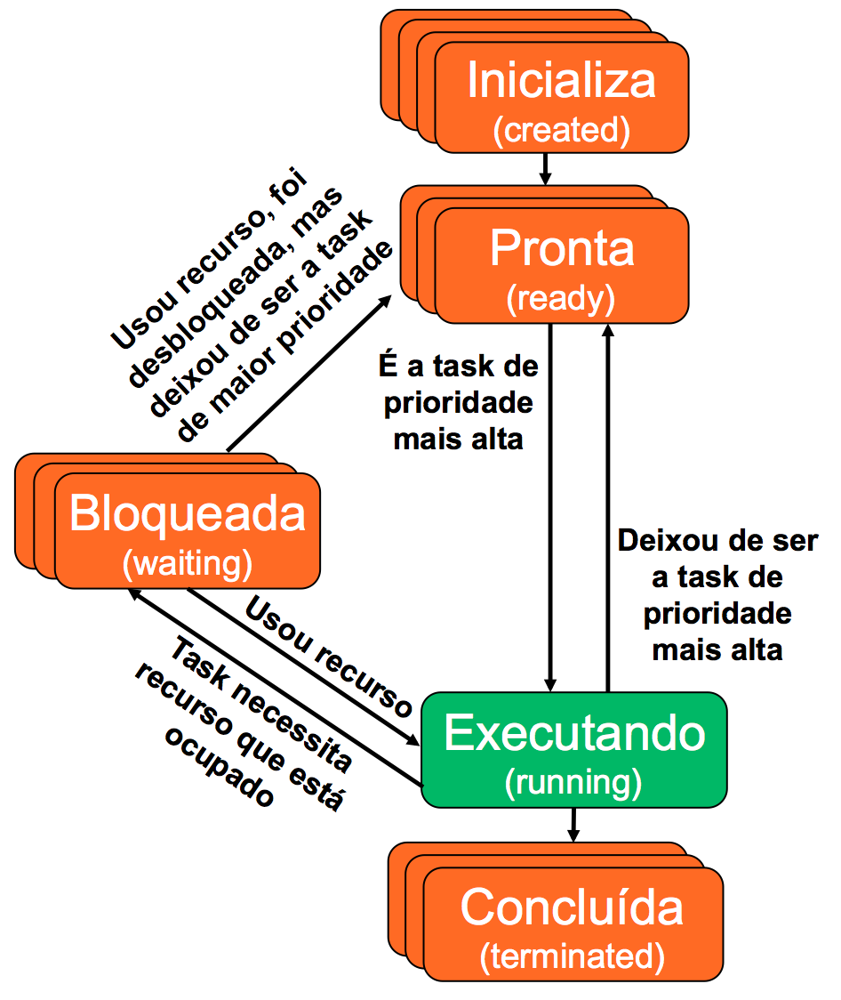

# Projeto Final – Escalonador

Implementação em C++ de um escalonador de tarefas, para utilização no controlador de uma máquina de venda de bebidas

## Descrição do sistema e requisitos

* A máquina de venda de refrigerantes fornece dois tipos de refrigerantes, denominados MEET e ETIRPS. Estes refrigerantes estão disponíveis para escolha pelo usuário a partir de duas teclas no painel com o nome dos refrigerantes. Ambos refrigerantes custam R$1,50 e existe na máquina uma fenda para inserir moedas com um sistema eletromecânico capaz de reconhecer moedas de R$1,00, R$0,50 e R$0,25, e capaz de devolver automaticamente qualquer outro tipo de moeda ou objeto não reconhecido. Além disso, durante a compra, o usuário pode desistir da transação e apertar a tecla DEV que devolve as moedas inseridas até o momento. Somente após acumular um crédito mínimo de R$1,50 o usuário pode obter um refrigerante. A devolução de excesso de moedas é automática sempre que o valor inserido antes de retirar um refrigerante ultrapassar R$1,50. Para simplificar o projeto do controlador, pode ser ignorada a composição exata das moedas inseridas na máquina, atendo-se apenas ao montante total inserido.

* A interface de entrada e saída deve ser implementada utilizando o conceito de polimorfismo, visando a adaptação do código em C++ para diferentes interfaces. A idéia é ter uma classe "interface", que possa assumir várias formas (várias implementações), dependendo de onde o programa for executado (ex. microcomputador; kit de desenvolvimento com microcontrolador embarcado em FPGA; kit de desenvolvimento com processador ARM;...).

* Utilizar uma estrutura de fila para armazenar as informações sobre as vendas realizadas (log). Sempre que uma nova venda for realizada, deverá ser incluído um novo nodo na fila contendo: nome do refrigerante vendido; valor do refrigerante; e data/hora da venda (usar o clock/calendar desenvolvido durante o semestre). A qualquer instante, o operador da máquina poderá realizar as seguintes consultas no log: listar o valor total de vendas; listar a quantidade vendida de cada refrigerante; e listar o período do dia com mais vendas. Lembrar que para realizar essas operações, a fila precisará ser esvaziada (log será reinicializado), e os dados transferidos para outra estrutura de dados (uma lista, por exemplo).

* Implementar um escalonador de tarefas, com preempção, para possibilitar a gerência da execução concorrente das operações da máquina de venda, principalmente:
    * Entrada e saída de dados (inserção de moedas, botões, fornecimento de refrigerantes,...).
    * Funcionamento da FSM de controle.
    * Operações de log (gravação do log, relatórios,...).
    * Relógio do sistema (ClockCalendar).

* Projetar o escalonador de acordo com políticas de escalonamento adequadas para esse tipo de aplicação, justificando as decisões de projeto. O objetivo é possibilitar a execução do sistema em uma plataforma computacional **sem sistema operacional**.

* Utilizar estruturas de dados do tipo listas duplamente encadeadas, para implementar as filas de tarefas apresentadas na Figura 1:
    * Tarefas que foram criadas, mas ainda não foram encaminhadas para a fila de tarefas prontas para execução.
    * Tarefas prontas para execução (ready).
    * Tarefas bloqueadas (waiting).
    * Tarefas concluídas (terminated).

* As estruturas de dados utilizadas no desenvolvimento do escalonador devem ser implementadas por intermédio de listas encadeadas, utilizando alocação dinâmica de memória. **Não devem ser utilizadas funções da STL**.

* Ao implementar as filas é importante respeitar os conceitos relacionados a esse tipo de estrutura de dados, ou seja, em uma fila só é possível realizar a inclusão no final (após o último nodo), e a leitura na frente da fila (primeiro nodo). Não devem existir facilidades para acesso aos demais nodos da fila, apenas o primeiro (leitura) e o último (escrita) nodo podem ser acessados.Caso necessite realizar alterações ou consultas nos elementos internos de uma estrutura, então deverá ser utilizada uma lista, e não uma fila.

* As filas devem ser modeladas por intermédio de classes na linguagem C++. Devem ser definidas classes para representar os nodos, e a lista encadeada propriamente dita.

* As filas devem ser utilizadas para armazenar apenas os blocos de controle de tarefas (Task Control Block - TCB).

* Utilizar um timer (sugestão de período de 1 ms) para a troca de contexto (chaveamento entre tarefas das filas), de acordo com a(s) política(s) de escalonamento definida.

* Tanto as estruturas de dados (filas, listas) quanto o TCB devem ser implementados por intermédio de classes, utilizando os diversos conceitos de C++ apresentados durante o semestre.

* Poderá ser utilizado o conceito de threads (pthread.h) para disparar a execução concorrente das diversas tarefas, mas a política de escalonamento deverá ser implementada com o auxílio das estruturas de dados conforme apresentado na Figura 1.

 
<em>Figura 1. Escalonamento das tarefas de controle da máquina de venda e refrigerantes.</em>

* Os principais desafios para a implementação do escalonador são:
    * Definir o que será escalonado. Poderia ser, por exemplo, um escalonador de objetos, onde são escalonadas funções (métodos) de classes.
    * Definir quais informações serão armazenadas no TCB, lembrando que deverá ser desenvolvido um escalonador "alto nível", que não possui acesso aos registradores da CPU.
    * Definir o que consiste exatamente o ponto de interrupção e reinício de uma tarefa. Por exemplo, ao ser preemptada, como saber exatamente qual ponto da execução da tarefa deverá ser retomado.
    * Como fazer para atender uma tarefa bloqueada devido aos comandos de entrada e saída (*cin*, *cout*,...), sem interromper a execução das demais tarefas? Uso de threads?
    * Definir como será realizada a contagem do tempo, e a interrupção para realizar o escalonamento das tarefas.
    * Definir quais políticas de escalonamento serão utilizadas.

### O software final deve possuir as seguintes funcionalidades:

1. Controle da máquina de venda de refrigerantes (recebe moedas, devolve moedas, fornece produtos, fornece troco).
2. Escalonamento das tarefas, utilizando listas e filas como estruturas de dados.

## Dicas e observações

* Desenvolver um ÚNICO software (pode ser composto por diversos arquivos .h e .cpp).

* O software deve ser projetado de forma a ser utilizado tanto em uma placa (sistema embarcado), quanto em um microcomputador (saída na tela do computador hospedeiro).

* Não existe necessidade de mostrar o funcionamento do software em um sistema embarcado, mas é necessário realizar a implementação (e compilação) visando também uma plataforma alvo a ser escolhida pelos alunos (exemplo: Raspberry Pi, LaunchPad,...).

* O software precisa ser desenvolvido utilizando classes, herança, polimorfismo, e outros mecanismos de orientação a objetos, conforme discutido nas aulas da disciplina.

* As tentativas mal sucedidas de utilização de recursos de programação da linguagem C++ no sistema embarcado alvo (devido a limitações do cross-compiler, por exemplo), devem ser relatadas, assim como as soluções adotadas.

* Preparar uma documentação (relatório técnico) descrevendo a arquitetura do sistema, ferramentas utilizadas, e o fluxo utilizado para o desenvolvimento do software. Incluir comentários sobre a experiência ao utilizar orientação a objetos na implementação desse tipo de sistema embarcado. Quais as vantagens e desvantagens? Quais recursos foram utilizados? Quais recursos gostaria de ter utilizado, e não foi possível devido as limitações do compilador? Porquê gostaria de ter utilizado (ou usou) determinados recursos? (exemplo: Reuso de módulos? Organização do código fonte?). Quais as estratégias adotadas para resolver os desafios apontados nessa definição do projeto?  A documentação é parte fundamental da avaliação, e deverá ser preparada de forma a possibilitar futuras alterações no software desenvolvido.

* Preparar um manual do usuário, que pode ser incluído no relatório técnico como um apêndice.

## Avaliação e entrega

* Será avaliado se na implementação do programa foram utilizados, pelo menos, os seguintes conceitos de C++:
    * Herança
    * Friends
    * Template
    * Funções virtuais
    * Tratamento de exceções
    * Sobrecarga de operadores
    * Polimorfismo (com classes abstratas)

* O trabalho de ser desenvolvido individualmente. O projeto e as soluções não devem ser compartilhadas entre os alunos, para evitar situações de plágio.

* Deve ser utilizado o github para o controle de versão e compartilhamento dos programas.

* Toda a documentação deve ser preparada e entregue em um único arquivo no formato PDF.

* O software pode ser desenvolvido e apresentado em um microcomputador, porém é preciso realizar a entrega da implementação necessária para utilização em um sistema embarcado.

* Aqueles que não pretendem executar o software na plataforma (sistema embarcado) destino, devem apresentar um relatório da compilação sem erros do programa, usando a arquitetura destino como alvo (cross-compiler). Isso é importante para mostrar que o programa não possui restrições para execução em um sistema embarcado sem sistema operacional. *IMPORTANTE!!! Não serão aceitos dois programas diferentes (um para o microcomputador, e outro para o sistema embarcado). Deverá ser desenvolvido um único programa que compile/funcione nas duas plataformas. Utilizar diretivas de compilação para o pré-processador do compilador selecionar os fontes que serão utilizados para gerar o binário para a arquitetura alvo*.

* A entrega do trabalho será realizada no moodle, respeitando os prazos estabelecidos.
